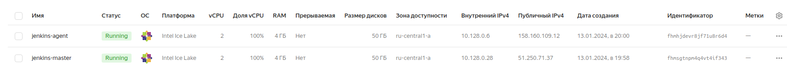
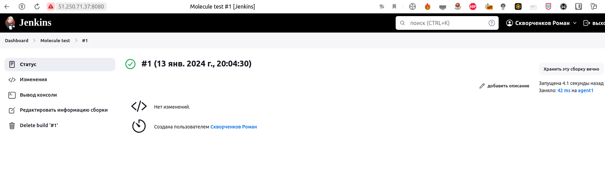
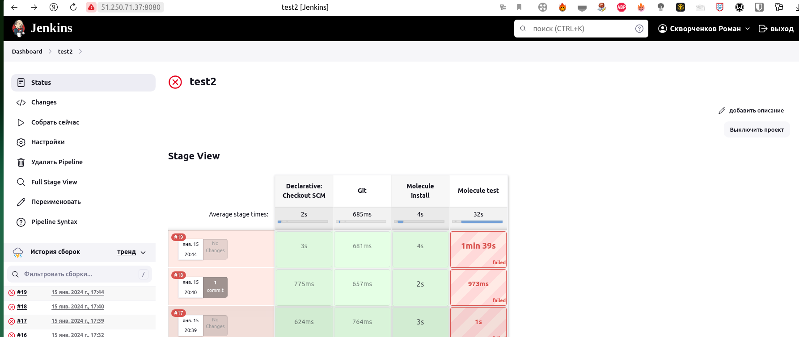
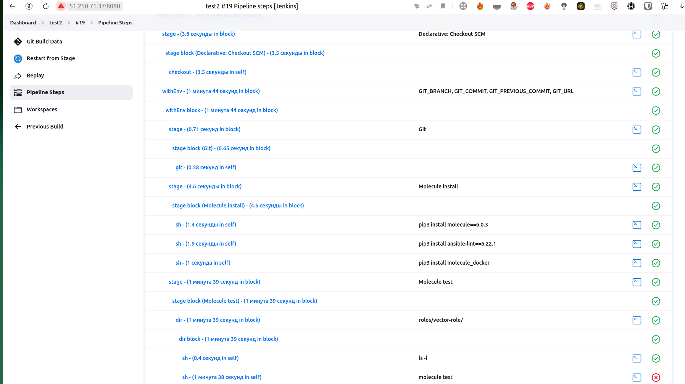
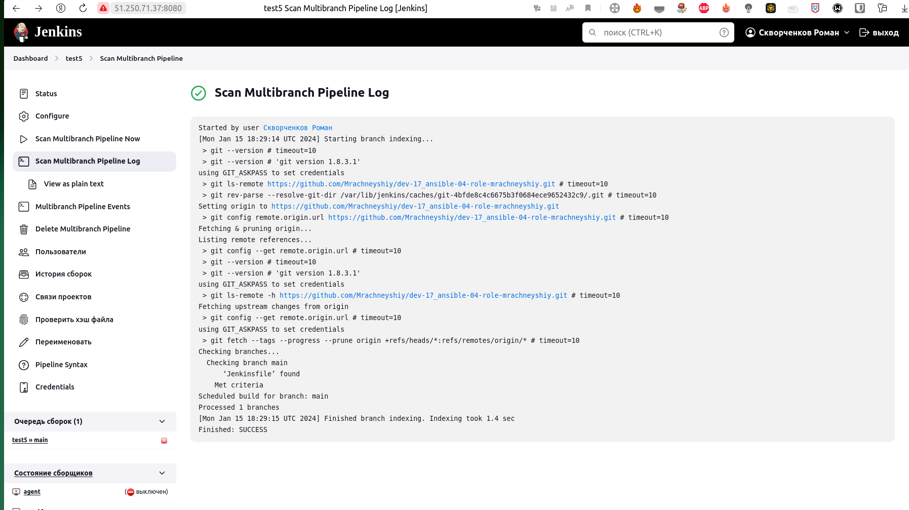
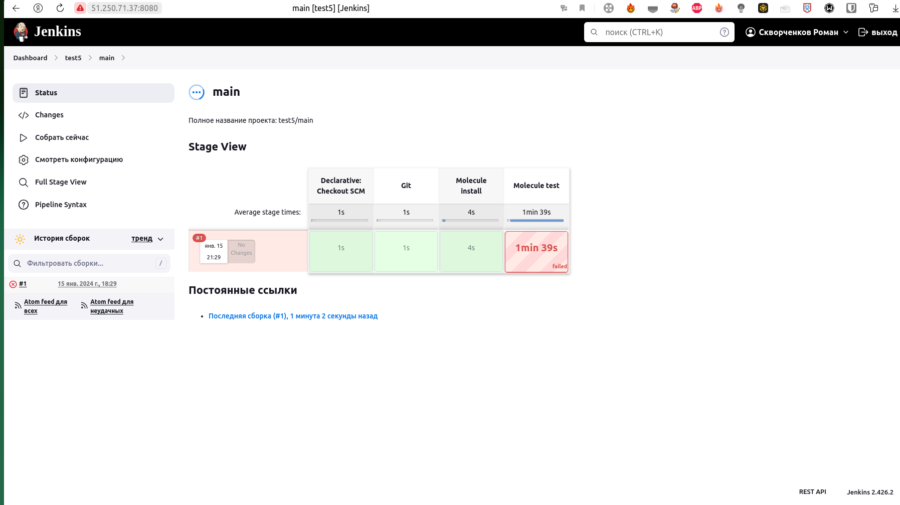
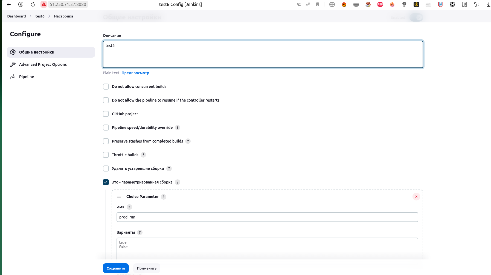
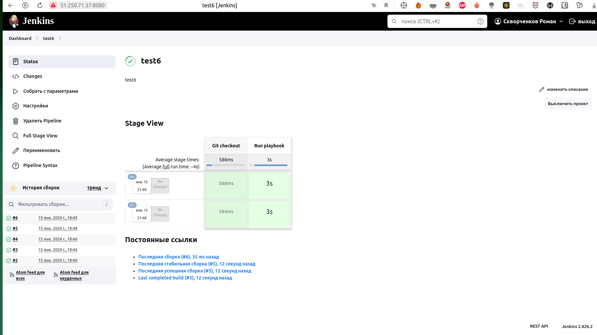

# Домашнее задание к занятию 10 «Jenkins»

## Подготовка к выполнению

1. Создать 2 VM: для jenkins-master и jenkins-agent.
2. Установить jenkins при помощи playbook'a.
3. Запустить и проверить работоспособность.
4. Сделать первоначальную настройку.



```bash
root@Ubuntu:/home/skvorchenkov/mnt-homeworks/09-ci-04-jenkins/infrastructure# ansible-playbook -i inventory/cicd/hosts.yml site.yml

PLAY [Preapre all hosts] ***************************************************************************************************************************************************

TASK [Gathering Facts] *****************************************************************************************************************************************************
The authenticity of host '158.160.109.12 (158.160.109.12)' can't be established.
ED25519 key fingerprint is SHA256:geU/gWFvYUaFbsRz7NUsv4tkBX4x1ITAOAjd5lG3KLw.
This key is not known by any other names
Are you sure you want to continue connecting (yes/no/[fingerprint])? ok: [jenkins-master-01]
yes
ok: [jenkins-agent-01]

TASK [Create group] ********************************************************************************************************************************************************
changed: [jenkins-agent-01]
changed: [jenkins-master-01]

TASK [Create user] *********************************************************************************************************************************************************
changed: [jenkins-master-01]
changed: [jenkins-agent-01]

TASK [Install JDK] *********************************************************************************************************************************************************
changed: [jenkins-agent-01]
changed: [jenkins-master-01]

PLAY [Get Jenkins master installed] ****************************************************************************************************************************************

TASK [Gathering Facts] *****************************************************************************************************************************************************
ok: [jenkins-master-01]

TASK [Get repo Jenkins] ****************************************************************************************************************************************************
changed: [jenkins-master-01]

TASK [Add Jenkins key] *****************************************************************************************************************************************************
changed: [jenkins-master-01]

TASK [Install epel-release] ************************************************************************************************************************************************
changed: [jenkins-master-01]

TASK [Install Jenkins and requirements] ************************************************************************************************************************************
changed: [jenkins-master-01]

TASK [Ensure jenkins agents are present in known_hosts file] ***************************************************************************************************************
# 158.160.109.12:22 SSH-2.0-OpenSSH_7.4
# 158.160.109.12:22 SSH-2.0-OpenSSH_7.4
# 158.160.109.12:22 SSH-2.0-OpenSSH_7.4
# 158.160.109.12:22 SSH-2.0-OpenSSH_7.4
# 158.160.109.12:22 SSH-2.0-OpenSSH_7.4
changed: [jenkins-master-01] => (item=jenkins-agent-01)
[WARNING]: Module remote_tmp /home/jenkins/.ansible/tmp did not exist and was created with a mode of 0700, this may cause issues when running as another user. To avoid
this, create the remote_tmp dir with the correct permissions manually

TASK [Start Jenkins] *******************************************************************************************************************************************************
changed: [jenkins-master-01]

PLAY [Prepare jenkins agent] ***********************************************************************************************************************************************

TASK [Gathering Facts] *****************************************************************************************************************************************************
ok: [jenkins-agent-01]

TASK [Add master publickey into authorized_key] ****************************************************************************************************************************
changed: [jenkins-agent-01]

TASK [Create agent_dir] ****************************************************************************************************************************************************
changed: [jenkins-agent-01]

TASK [Add docker repo] *****************************************************************************************************************************************************
changed: [jenkins-agent-01]

TASK [Install some required] ***********************************************************************************************************************************************
changed: [jenkins-agent-01]

TASK [Update pip] **********************************************************************************************************************************************************
changed: [jenkins-agent-01]

TASK [Install Ansible] *****************************************************************************************************************************************************
changed: [jenkins-agent-01]

TASK [Reinstall Selinux] ***************************************************************************************************************************************************
changed: [jenkins-agent-01]

TASK [Add local to PATH] ***************************************************************************************************************************************************
changed: [jenkins-agent-01]

TASK [Create docker group] *************************************************************************************************************************************************
ok: [jenkins-agent-01]

TASK [Add jenkinsuser to dockergroup] **************************************************************************************************************************************
changed: [jenkins-agent-01]

TASK [Restart docker] ******************************************************************************************************************************************************
changed: [jenkins-agent-01]

TASK [Install agent.jar] ***************************************************************************************************************************************************
changed: [jenkins-agent-01]

PLAY RECAP *****************************************************************************************************************************************************************
jenkins-agent-01           : ok=17   changed=14   unreachable=0    failed=0    skipped=0    rescued=0    ignored=0   
jenkins-master-01          : ok=11   changed=9    unreachable=0    failed=0    skipped=0    rescued=0    ignored=0  

```

## Основная часть

#### Решение 

Пришлось сделать Fork репозитория с ролью, так как у меня их нормальных нет.

1. Сделать Freestyle Job, который будет запускать `molecule test` из любого вашего репозитория с ролью.




2. Сделать Declarative Pipeline Job, который будет запускать `molecule test` из любого вашего репозитория с ролью.




<details><summary>Logs</summary>
Started by user Скворченков Роман
Obtained Jenkinsfile from git https://github.com/Mrachneyshiy/dev-17_ansible-04-role-mrachneyshiy.git
[Pipeline] Start of Pipeline
[Pipeline] node
Still waiting to schedule task
All nodes of label ‘linux’ are offline
Running on agent1 in /opt/jenkins_agent/workspace/test2
[Pipeline] {
[Pipeline] stage
[Pipeline] { (Declarative: Checkout SCM)
[Pipeline] checkout
Selected Git installation does not exist. Using Default
The recommended git tool is: NONE
using credential d961d514-ae80-4f6c-a625-ee62bb36ce66
Fetching changes from the remote Git repository
 > git rev-parse --resolve-git-dir /opt/jenkins_agent/workspace/test2/.git # timeout=10
Checking out Revision d4a64ad0e6b6fa4e263d29b6414c71c907b1d7e5 (refs/remotes/origin/main)
Commit message: "Update Jenkinsfile"
 > git config remote.origin.url https://github.com/Mrachneyshiy/dev-17_ansible-04-role-mrachneyshiy.git # timeout=10
Fetching upstream changes from https://github.com/Mrachneyshiy/dev-17_ansible-04-role-mrachneyshiy.git
 > git --version # timeout=10
 > git --version # 'git version 2.38.1'
using GIT_ASKPASS to set credentials 
 > git fetch --tags --force --progress -- https://github.com/Mrachneyshiy/dev-17_ansible-04-role-mrachneyshiy.git +refs/heads/*:refs/remotes/origin/* # timeout=10
 > git rev-parse refs/remotes/origin/main^{commit} # timeout=10
 > git config core.sparsecheckout # timeout=10
 > git checkout -f d4a64ad0e6b6fa4e263d29b6414c71c907b1d7e5 # timeout=10
 > git rev-list --no-walk d4a64ad0e6b6fa4e263d29b6414c71c907b1d7e5 # timeout=10
[Pipeline] }
[Pipeline] // stage
[Pipeline] withEnv
[Pipeline] {
[Pipeline] stage
[Pipeline] { (Git)
[Pipeline] git
Selected Git installation does not exist. Using Default
The recommended git tool is: NONE
using credential d961d514-ae80-4f6c-a625-ee62bb36ce66
Fetching changes from the remote Git repository
Checking out Revision d4a64ad0e6b6fa4e263d29b6414c71c907b1d7e5 (refs/remotes/origin/main)
Commit message: "Update Jenkinsfile"
[Pipeline] }
[Pipeline] // stage
[Pipeline] stage
[Pipeline] { (Molecule install)
[Pipeline] sh
 > git rev-parse --resolve-git-dir /opt/jenkins_agent/workspace/test2/.git # timeout=10
 > git config remote.origin.url https://github.com/Mrachneyshiy/dev-17_ansible-04-role-mrachneyshiy.git # timeout=10
Fetching upstream changes from https://github.com/Mrachneyshiy/dev-17_ansible-04-role-mrachneyshiy.git
 > git --version # timeout=10
 > git --version # 'git version 2.38.1'
using GIT_ASKPASS to set credentials 
 > git fetch --tags --force --progress -- https://github.com/Mrachneyshiy/dev-17_ansible-04-role-mrachneyshiy.git +refs/heads/*:refs/remotes/origin/* # timeout=10
 > git rev-parse refs/remotes/origin/main^{commit} # timeout=10
 > git config core.sparsecheckout # timeout=10
 > git checkout -f d4a64ad0e6b6fa4e263d29b6414c71c907b1d7e5 # timeout=10
 > git branch -a -v --no-abbrev # timeout=10
 > git branch -D main # timeout=10
 > git checkout -b main d4a64ad0e6b6fa4e263d29b6414c71c907b1d7e5 # timeout=10
+ pip3 install molecule==6.0.3
Requirement already satisfied: molecule==6.0.3 in /usr/local/lib/python3.10/site-packages (6.0.3)
Requirement already satisfied: jsonschema>=4.9.1 in /usr/local/lib/python3.10/site-packages (from molecule==6.0.3) (4.20.0)
Requirement already satisfied: Jinja2>=2.11.3 in /usr/lib/python3.10/site-packages (from molecule==6.0.3) (3.0.1)
Requirement already satisfied: click<9,>=8.0 in /usr/local/lib/python3.10/site-packages (from molecule==6.0.3) (8.1.7)
Requirement already satisfied: PyYAML>=5.1 in /usr/lib64/python3.10/site-packages (from molecule==6.0.3) (5.4.1)
Requirement already satisfied: ansible-core>=2.12.10 in /usr/local/lib/python3.10/site-packages (from molecule==6.0.3) (2.16.2)
Requirement already satisfied: enrich>=1.2.7 in /usr/local/lib/python3.10/site-packages (from molecule==6.0.3) (1.2.7)
Requirement already satisfied: ansible-compat>=4.1.8 in /usr/local/lib/python3.10/site-packages (from molecule==6.0.3) (4.1.11)
Requirement already satisfied: wcmatch>=8.1.2 in /usr/local/lib/python3.10/site-packages (from molecule==6.0.3) (8.5)
Requirement already satisfied: pluggy<2.0,>=0.7.1 in /usr/local/lib/python3.10/site-packages (from molecule==6.0.3) (0.13.1)
Requirement already satisfied: packaging in /usr/local/lib/python3.10/site-packages (from molecule==6.0.3) (23.2)
Requirement already satisfied: click-help-colors>=0.9 in /usr/local/lib/python3.10/site-packages (from molecule==6.0.3) (0.9.4)
Requirement already satisfied: rich>=9.5.1 in /usr/local/lib/python3.10/site-packages (from molecule==6.0.3) (13.7.0)
Requirement already satisfied: subprocess-tee>=0.4.1 in /usr/local/lib/python3.10/site-packages (from ansible-compat>=4.1.8->molecule==6.0.3) (0.4.1)
Requirement already satisfied: cryptography in /usr/lib64/python3.10/site-packages (from ansible-core>=2.12.10->molecule==6.0.3) (3.4.7)
Requirement already satisfied: resolvelib<1.1.0,>=0.5.3 in /usr/local/lib/python3.10/site-packages (from ansible-core>=2.12.10->molecule==6.0.3) (1.0.1)
Requirement already satisfied: MarkupSafe>=2.0 in /usr/lib64/python3.10/site-packages (from Jinja2>=2.11.3->molecule==6.0.3) (2.0.0)
Requirement already satisfied: jsonschema-specifications>=2023.03.6 in /usr/local/lib/python3.10/site-packages (from jsonschema>=4.9.1->molecule==6.0.3) (2023.12.1)
Requirement already satisfied: referencing>=0.28.4 in /usr/local/lib/python3.10/site-packages (from jsonschema>=4.9.1->molecule==6.0.3) (0.32.1)
Requirement already satisfied: rpds-py>=0.7.1 in /usr/local/lib64/python3.10/site-packages (from jsonschema>=4.9.1->molecule==6.0.3) (0.17.1)
Requirement already satisfied: attrs>=22.2.0 in /usr/local/lib/python3.10/site-packages (from jsonschema>=4.9.1->molecule==6.0.3) (23.2.0)
Requirement already satisfied: markdown-it-py>=2.2.0 in /usr/local/lib/python3.10/site-packages (from rich>=9.5.1->molecule==6.0.3) (3.0.0)
Requirement already satisfied: pygments<3.0.0,>=2.13.0 in /usr/local/lib/python3.10/site-packages (from rich>=9.5.1->molecule==6.0.3) (2.17.2)
Requirement already satisfied: mdurl~=0.1 in /usr/local/lib/python3.10/site-packages (from markdown-it-py>=2.2.0->rich>=9.5.1->molecule==6.0.3) (0.1.2)
Requirement already satisfied: bracex>=2.1.1 in /usr/local/lib/python3.10/site-packages (from wcmatch>=8.1.2->molecule==6.0.3) (2.4)
Requirement already satisfied: cffi>=1.12 in /usr/lib64/python3.10/site-packages (from cryptography->ansible-core>=2.12.10->molecule==6.0.3) (1.15.0)
Requirement already satisfied: pycparser in /usr/lib/python3.10/site-packages (from cffi>=1.12->cryptography->ansible-core>=2.12.10->molecule==6.0.3) (2.20)
Requirement already satisfied: ply==3.11 in /usr/lib/python3.10/site-packages (from pycparser->cffi>=1.12->cryptography->ansible-core>=2.12.10->molecule==6.0.3) (3.11)
WARNING: Running pip as the 'root' user can result in broken permissions and conflicting behaviour with the system package manager. It is recommended to use a virtual environment instead: https://pip.pypa.io/warnings/venv
[Pipeline] sh
+ pip3 install ansible-lint==6.22.1
Collecting ansible-lint==6.22.1
  Using cached ansible_lint-6.22.1-py3-none-any.whl (296 kB)
Requirement already satisfied: jsonschema>=4.10.0 in /usr/local/lib/python3.10/site-packages (from ansible-lint==6.22.1) (4.20.0)
Requirement already satisfied: ruamel.yaml>=0.18.5 in /usr/local/lib/python3.10/site-packages (from ansible-lint==6.22.1) (0.18.5)
Requirement already satisfied: pathspec>=0.10.3 in /usr/local/lib/python3.10/site-packages (from ansible-lint==6.22.1) (0.12.1)
Requirement already satisfied: rich>=12.0.0 in /usr/local/lib/python3.10/site-packages (from ansible-lint==6.22.1) (13.7.0)
Requirement already satisfied: pyyaml>=5.4.1 in /usr/lib64/python3.10/site-packages (from ansible-lint==6.22.1) (5.4.1)
Requirement already satisfied: requests>=2.31.0 in /usr/local/lib/python3.10/site-packages (from ansible-lint==6.22.1) (2.31.0)
Requirement already satisfied: wcmatch>=8.1.2 in /usr/local/lib/python3.10/site-packages (from ansible-lint==6.22.1) (8.5)
Requirement already satisfied: packaging>=21.3 in /usr/local/lib/python3.10/site-packages (from ansible-lint==6.22.1) (23.2)
Requirement already satisfied: ansible-core>=2.12.0 in /usr/local/lib/python3.10/site-packages (from ansible-lint==6.22.1) (2.16.2)
Requirement already satisfied: filelock>=3.3.0 in /usr/local/lib/python3.10/site-packages (from ansible-lint==6.22.1) (3.13.1)
Requirement already satisfied: subprocess-tee>=0.4.1 in /usr/local/lib/python3.10/site-packages (from ansible-lint==6.22.1) (0.4.1)
Requirement already satisfied: ansible-compat>=4.1.10 in /usr/local/lib/python3.10/site-packages (from ansible-lint==6.22.1) (4.1.11)
Requirement already satisfied: yamllint>=1.30.0 in /usr/local/lib/python3.10/site-packages (from ansible-lint==6.22.1) (1.33.0)
Requirement already satisfied: black>=22.8.0 in /usr/local/lib64/python3.10/site-packages (from ansible-lint==6.22.1) (23.12.1)
Requirement already satisfied: jinja2>=3.0.0 in /usr/lib/python3.10/site-packages (from ansible-core>=2.12.0->ansible-lint==6.22.1) (3.0.1)
Requirement already satisfied: cryptography in /usr/lib64/python3.10/site-packages (from ansible-core>=2.12.0->ansible-lint==6.22.1) (3.4.7)
Requirement already satisfied: resolvelib<1.1.0,>=0.5.3 in /usr/local/lib/python3.10/site-packages (from ansible-core>=2.12.0->ansible-lint==6.22.1) (1.0.1)
Requirement already satisfied: typing-extensions>=4.0.1 in /usr/local/lib/python3.10/site-packages (from black>=22.8.0->ansible-lint==6.22.1) (4.9.0)
Requirement already satisfied: platformdirs>=2 in /usr/local/lib/python3.10/site-packages (from black>=22.8.0->ansible-lint==6.22.1) (4.1.0)
Requirement already satisfied: mypy-extensions>=0.4.3 in /usr/local/lib/python3.10/site-packages (from black>=22.8.0->ansible-lint==6.22.1) (1.0.0)
Requirement already satisfied: click>=8.0.0 in /usr/local/lib/python3.10/site-packages (from black>=22.8.0->ansible-lint==6.22.1) (8.1.7)
Requirement already satisfied: tomli>=1.1.0 in /usr/local/lib/python3.10/site-packages (from black>=22.8.0->ansible-lint==6.22.1) (2.0.1)
Requirement already satisfied: MarkupSafe>=2.0 in /usr/lib64/python3.10/site-packages (from jinja2>=3.0.0->ansible-core>=2.12.0->ansible-lint==6.22.1) (2.0.0)
Requirement already satisfied: referencing>=0.28.4 in /usr/local/lib/python3.10/site-packages (from jsonschema>=4.10.0->ansible-lint==6.22.1) (0.32.1)
Requirement already satisfied: attrs>=22.2.0 in /usr/local/lib/python3.10/site-packages (from jsonschema>=4.10.0->ansible-lint==6.22.1) (23.2.0)
Requirement already satisfied: rpds-py>=0.7.1 in /usr/local/lib64/python3.10/site-packages (from jsonschema>=4.10.0->ansible-lint==6.22.1) (0.17.1)
Requirement already satisfied: jsonschema-specifications>=2023.03.6 in /usr/local/lib/python3.10/site-packages (from jsonschema>=4.10.0->ansible-lint==6.22.1) (2023.12.1)
Requirement already satisfied: urllib3<3,>=1.21.1 in /usr/lib/python3.10/site-packages (from requests>=2.31.0->ansible-lint==6.22.1) (1.26.12)
Requirement already satisfied: certifi>=2017.4.17 in /usr/local/lib/python3.10/site-packages (from requests>=2.31.0->ansible-lint==6.22.1) (2023.11.17)
Requirement already satisfied: charset-normalizer<4,>=2 in /usr/lib/python3.10/site-packages (from requests>=2.31.0->ansible-lint==6.22.1) (2.0.4)
Requirement already satisfied: idna<4,>=2.5 in /usr/lib/python3.10/site-packages (from requests>=2.31.0->ansible-lint==6.22.1) (3.2)
Requirement already satisfied: pygments<3.0.0,>=2.13.0 in /usr/local/lib/python3.10/site-packages (from rich>=12.0.0->ansible-lint==6.22.1) (2.17.2)
Requirement already satisfied: markdown-it-py>=2.2.0 in /usr/local/lib/python3.10/site-packages (from rich>=12.0.0->ansible-lint==6.22.1) (3.0.0)
Requirement already satisfied: mdurl~=0.1 in /usr/local/lib/python3.10/site-packages (from markdown-it-py>=2.2.0->rich>=12.0.0->ansible-lint==6.22.1) (0.1.2)
Requirement already satisfied: ruamel.yaml.clib>=0.2.7 in /usr/local/lib64/python3.10/site-packages (from ruamel.yaml>=0.18.5->ansible-lint==6.22.1) (0.2.8)
Requirement already satisfied: bracex>=2.1.1 in /usr/local/lib/python3.10/site-packages (from wcmatch>=8.1.2->ansible-lint==6.22.1) (2.4)
Requirement already satisfied: cffi>=1.12 in /usr/lib64/python3.10/site-packages (from cryptography->ansible-core>=2.12.0->ansible-lint==6.22.1) (1.15.0)
Requirement already satisfied: pycparser in /usr/lib/python3.10/site-packages (from cffi>=1.12->cryptography->ansible-core>=2.12.0->ansible-lint==6.22.1) (2.20)
Requirement already satisfied: ply==3.11 in /usr/lib/python3.10/site-packages (from pycparser->cffi>=1.12->cryptography->ansible-core>=2.12.0->ansible-lint==6.22.1) (3.11)
Installing collected packages: ansible-lint
  Attempting uninstall: ansible-lint
    Found existing installation: ansible-lint 5.4.0
    Uninstalling ansible-lint-5.4.0:
      Successfully uninstalled ansible-lint-5.4.0
Successfully installed ansible-lint-6.22.1
WARNING: Running pip as the 'root' user can result in broken permissions and conflicting behaviour with the system package manager. It is recommended to use a virtual environment instead: https://pip.pypa.io/warnings/venv
[Pipeline] sh
+ pip3 install molecule_docker
Requirement already satisfied: molecule_docker in /usr/local/lib/python3.10/site-packages (2.1.0)
Requirement already satisfied: requests in /usr/local/lib/python3.10/site-packages (from molecule_docker) (2.31.0)
Requirement already satisfied: molecule>=4.0.0 in /usr/local/lib/python3.10/site-packages (from molecule_docker) (6.0.3)
Requirement already satisfied: selinux in /usr/lib64/python3.10/site-packages (from molecule_docker) (3.3)
Requirement already satisfied: docker>=4.3.1 in /usr/local/lib/python3.10/site-packages (from molecule_docker) (7.0.0)
Requirement already satisfied: packaging>=14.0 in /usr/local/lib/python3.10/site-packages (from docker>=4.3.1->molecule_docker) (23.2)
Requirement already satisfied: urllib3>=1.26.0 in /usr/lib/python3.10/site-packages (from docker>=4.3.1->molecule_docker) (1.26.12)
Requirement already satisfied: enrich>=1.2.7 in /usr/local/lib/python3.10/site-packages (from molecule>=4.0.0->molecule_docker) (1.2.7)
Requirement already satisfied: pluggy<2.0,>=0.7.1 in /usr/local/lib/python3.10/site-packages (from molecule>=4.0.0->molecule_docker) (0.13.1)
Requirement already satisfied: jsonschema>=4.9.1 in /usr/local/lib/python3.10/site-packages (from molecule>=4.0.0->molecule_docker) (4.20.0)
Requirement already satisfied: ansible-core>=2.12.10 in /usr/local/lib/python3.10/site-packages (from molecule>=4.0.0->molecule_docker) (2.16.2)
Requirement already satisfied: rich>=9.5.1 in /usr/local/lib/python3.10/site-packages (from molecule>=4.0.0->molecule_docker) (13.7.0)
Requirement already satisfied: Jinja2>=2.11.3 in /usr/lib/python3.10/site-packages (from molecule>=4.0.0->molecule_docker) (3.0.1)
Requirement already satisfied: click-help-colors>=0.9 in /usr/local/lib/python3.10/site-packages (from molecule>=4.0.0->molecule_docker) (0.9.4)
Requirement already satisfied: PyYAML>=5.1 in /usr/lib64/python3.10/site-packages (from molecule>=4.0.0->molecule_docker) (5.4.1)
Requirement already satisfied: ansible-compat>=4.1.8 in /usr/local/lib/python3.10/site-packages (from molecule>=4.0.0->molecule_docker) (4.1.11)
Requirement already satisfied: click<9,>=8.0 in /usr/local/lib/python3.10/site-packages (from molecule>=4.0.0->molecule_docker) (8.1.7)
Requirement already satisfied: wcmatch>=8.1.2 in /usr/local/lib/python3.10/site-packages (from molecule>=4.0.0->molecule_docker) (8.5)
Requirement already satisfied: subprocess-tee>=0.4.1 in /usr/local/lib/python3.10/site-packages (from ansible-compat>=4.1.8->molecule>=4.0.0->molecule_docker) (0.4.1)
Requirement already satisfied: resolvelib<1.1.0,>=0.5.3 in /usr/local/lib/python3.10/site-packages (from ansible-core>=2.12.10->molecule>=4.0.0->molecule_docker) (1.0.1)
Requirement already satisfied: cryptography in /usr/lib64/python3.10/site-packages (from ansible-core>=2.12.10->molecule>=4.0.0->molecule_docker) (3.4.7)
Requirement already satisfied: MarkupSafe>=2.0 in /usr/lib64/python3.10/site-packages (from Jinja2>=2.11.3->molecule>=4.0.0->molecule_docker) (2.0.0)
Requirement already satisfied: referencing>=0.28.4 in /usr/local/lib/python3.10/site-packages (from jsonschema>=4.9.1->molecule>=4.0.0->molecule_docker) (0.32.1)
Requirement already satisfied: jsonschema-specifications>=2023.03.6 in /usr/local/lib/python3.10/site-packages (from jsonschema>=4.9.1->molecule>=4.0.0->molecule_docker) (2023.12.1)
Requirement already satisfied: rpds-py>=0.7.1 in /usr/local/lib64/python3.10/site-packages (from jsonschema>=4.9.1->molecule>=4.0.0->molecule_docker) (0.17.1)
Requirement already satisfied: attrs>=22.2.0 in /usr/local/lib/python3.10/site-packages (from jsonschema>=4.9.1->molecule>=4.0.0->molecule_docker) (23.2.0)
Requirement already satisfied: certifi>=2017.4.17 in /usr/local/lib/python3.10/site-packages (from requests->molecule_docker) (2023.11.17)
Requirement already satisfied: idna<4,>=2.5 in /usr/lib/python3.10/site-packages (from requests->molecule_docker) (3.2)
Requirement already satisfied: charset-normalizer<4,>=2 in /usr/lib/python3.10/site-packages (from requests->molecule_docker) (2.0.4)
Requirement already satisfied: pygments<3.0.0,>=2.13.0 in /usr/local/lib/python3.10/site-packages (from rich>=9.5.1->molecule>=4.0.0->molecule_docker) (2.17.2)
Requirement already satisfied: markdown-it-py>=2.2.0 in /usr/local/lib/python3.10/site-packages (from rich>=9.5.1->molecule>=4.0.0->molecule_docker) (3.0.0)
Requirement already satisfied: mdurl~=0.1 in /usr/local/lib/python3.10/site-packages (from markdown-it-py>=2.2.0->rich>=9.5.1->molecule>=4.0.0->molecule_docker) (0.1.2)
Requirement already satisfied: bracex>=2.1.1 in /usr/local/lib/python3.10/site-packages (from wcmatch>=8.1.2->molecule>=4.0.0->molecule_docker) (2.4)
Requirement already satisfied: cffi>=1.12 in /usr/lib64/python3.10/site-packages (from cryptography->ansible-core>=2.12.10->molecule>=4.0.0->molecule_docker) (1.15.0)
Requirement already satisfied: pycparser in /usr/lib/python3.10/site-packages (from cffi>=1.12->cryptography->ansible-core>=2.12.10->molecule>=4.0.0->molecule_docker) (2.20)
Requirement already satisfied: ply==3.11 in /usr/lib/python3.10/site-packages (from pycparser->cffi>=1.12->cryptography->ansible-core>=2.12.10->molecule>=4.0.0->molecule_docker) (3.11)
WARNING: Running pip as the 'root' user can result in broken permissions and conflicting behaviour with the system package manager. It is recommended to use a virtual environment instead: https://pip.pypa.io/warnings/venv
[Pipeline] }
[Pipeline] // stage
[Pipeline] stage
[Pipeline] { (Molecule test)
[Pipeline] dir
Running in /opt/jenkins_agent/workspace/test2/roles/vector-role
[Pipeline] {
[Pipeline] sh
+ ls -l
total 24
drwxr-xr-x. 2 root root  22 Jan 15 17:44 defaults
-rw-r--r--. 1 root root 962 Jan 15 17:44 Dockerfile
drwxr-xr-x. 2 root root  22 Jan 15 17:44 handlers
-rw-r--r--. 1 root root 773 Jan 15 17:44 Jenkinsfile
drwxr-xr-x. 2 root root  50 Jan 15 17:44 meta
drwxr-xr-x. 5 root root  62 Jan 15 17:44 molecule
-rw-r--r--. 1 root root 954 Jan 15 17:44 README.md
-rw-r--r--. 1 root root 430 Jan 15 17:44 ScriptedJenkinsfile
drwxr-xr-x. 2 root root  22 Jan 15 17:44 tasks
drwxr-xr-x. 2 root root  48 Jan 15 17:44 templates
drwxr-xr-x. 2 root root  39 Jan 15 17:44 tests
-rw-r--r--. 1 root root 280 Jan 15 17:44 tox.ini
-rw-r--r--. 1 root root  90 Jan 15 17:44 tox-requirements.txt
drwxr-xr-x. 2 root root  22 Jan 15 17:44 vars
[Pipeline] sh
+ molecule test
WARNING  Driver docker does not provide a schema.
INFO     default scenario test matrix: dependency, cleanup, destroy, syntax, create, prepare, converge, idempotence, side_effect, verify, cleanup, destroy
INFO     Performing prerun with role_name_check=0...
INFO     Running default > dependency
WARNING  Skipping, missing the requirements file.
WARNING  Skipping, missing the requirements file.
INFO     Running default > cleanup
WARNING  Skipping, cleanup playbook not configured.
INFO     Running default > destroy
INFO     Sanity checks: 'docker'

PLAY [Destroy] *****************************************************************

TASK [Set async_dir for HOME env] **********************************************
ok: [localhost]

TASK [Destroy molecule instance(s)] ********************************************
changed: [localhost] => (item=instance)

TASK [Wait for instance(s) deletion to complete] *******************************
FAILED - RETRYING: [localhost]: Wait for instance(s) deletion to complete (300 retries left).
ok: [localhost] => (item=instance)

TASK [Delete docker networks(s)] ***********************************************
skipping: [localhost]

PLAY RECAP *********************************************************************
localhost                  : ok=3    changed=1    unreachable=0    failed=0    skipped=1    rescued=0    ignored=0

INFO     Running default > syntax

playbook: /opt/jenkins_agent/workspace/test2/roles/vector-role/molecule/default/converge.yml
INFO     Running default > create

PLAY [Create] ******************************************************************

TASK [Set async_dir for HOME env] **********************************************
ok: [localhost]

TASK [Log into a Docker registry] **********************************************
skipping: [localhost] => (item=None) 
skipping: [localhost]

TASK [Check presence of custom Dockerfiles] ************************************
ok: [localhost] => (item={'image': 'docker.io/pycontribs/centos:7', 'name': 'instance', 'pre_build_image': True})

TASK [Create Dockerfiles from image names] *************************************
skipping: [localhost] => (item={'image': 'docker.io/pycontribs/centos:7', 'name': 'instance', 'pre_build_image': True})
skipping: [localhost]

TASK [Synchronization the context] *********************************************
skipping: [localhost] => (item={'image': 'docker.io/pycontribs/centos:7', 'name': 'instance', 'pre_build_image': True})
skipping: [localhost]

TASK [Discover local Docker images] ********************************************
ok: [localhost] => (item={'changed': False, 'skipped': True, 'skip_reason': 'Conditional result was False', 'false_condition': 'not item.pre_build_image | default(false)', 'item': {'image': 'docker.io/pycontribs/centos:7', 'name': 'instance', 'pre_build_image': True}, 'ansible_loop_var': 'item', 'i': 0, 'ansible_index_var': 'i'})

TASK [Build an Ansible compatible image (new)] *********************************
skipping: [localhost] => (item=molecule_local/docker.io/pycontribs/centos:7) 
skipping: [localhost]

TASK [Create docker network(s)] ************************************************
skipping: [localhost]

TASK [Determine the CMD directives] ********************************************
ok: [localhost] => (item={'image': 'docker.io/pycontribs/centos:7', 'name': 'instance', 'pre_build_image': True})

TASK [Create molecule instance(s)] *********************************************
changed: [localhost] => (item=instance)

TASK [Wait for instance(s) creation to complete] *******************************
FAILED - RETRYING: [localhost]: Wait for instance(s) creation to complete (300 retries left).
changed: [localhost] => (item={'failed': 0, 'started': 1, 'finished': 0, 'ansible_job_id': 'j474181919533.37579', 'results_file': '/root/.ansible_async/j474181919533.37579', 'changed': True, 'item': {'image': 'docker.io/pycontribs/centos:7', 'name': 'instance', 'pre_build_image': True}, 'ansible_loop_var': 'item'})

PLAY RECAP *********************************************************************
localhost                  : ok=6    changed=2    unreachable=0    failed=0    skipped=5    rescued=0    ignored=0

INFO     Running default > prepare
WARNING  Skipping, prepare playbook not configured.
INFO     Running default > converge

PLAY [Converge] ****************************************************************

TASK [Gathering Facts] *********************************************************
ok: [instance]

TASK [Include vector-role] *****************************************************

TASK [vector-role : Get Vector distrib | CentOS] *******************************
changed: [instance]

TASK [vector-role : Get Vector distrib | Ubuntu] *******************************
skipping: [instance]

TASK [vector-role : Install Vector packages | CentOS] **************************
changed: [instance]

TASK [vector-role : Install Vector packages | Ubuntu] **************************
skipping: [instance]

TASK [vector-role : Deploy config Vector] **************************************
changed: [instance]

TASK [vector-role : Creates directory] *****************************************
changed: [instance]

TASK [vector-role : Create systemd unit Vector] ********************************
changed: [instance]

TASK [vector-role : Start Vector service] **************************************
skipping: [instance]

RUNNING HANDLER [vector-role : Start Vector service] ***************************
skipping: [instance]

PLAY RECAP *********************************************************************
instance                   : ok=6    changed=5    unreachable=0    failed=0    skipped=4    rescued=0    ignored=0

INFO     Running default > idempotence

PLAY [Converge] ****************************************************************

TASK [Gathering Facts] *********************************************************
ok: [instance]

TASK [Include vector-role] *****************************************************

TASK [vector-role : Get Vector distrib | CentOS] *******************************
ok: [instance]

TASK [vector-role : Get Vector distrib | Ubuntu] *******************************
skipping: [instance]

TASK [vector-role : Install Vector packages | CentOS] **************************
ok: [instance]

TASK [vector-role : Install Vector packages | Ubuntu] **************************
skipping: [instance]

TASK [vector-role : Deploy config Vector] **************************************
ok: [instance]

TASK [vector-role : Creates directory] *****************************************
ok: [instance]

TASK [vector-role : Create systemd unit Vector] ********************************
ok: [instance]

TASK [vector-role : Start Vector service] **************************************
skipping: [instance]

PLAY RECAP *********************************************************************
instance                   : ok=6    changed=0    unreachable=0    failed=0    skipped=3    rescued=0    ignored=0

INFO     Idempotence completed successfully.
INFO     Running default > side_effect
WARNING  Skipping, side effect playbook not configured.
INFO     Running default > verify
INFO     Running Ansible Verifier

PLAY [Verify] ******************************************************************

TASK [Get Vector version] ******************************************************
ok: [instance]

TASK [Assert Vector instalation] ***********************************************
fatal: [instance]: FAILED! => {"msg": "The conditional check ''0' == '0'' failed. The error was: Conditional is marked as unsafe, and cannot be evaluated."}

PLAY RECAP *********************************************************************
instance                   : ok=1    changed=0    unreachable=0    failed=1    skipped=0    rescued=0    ignored=0

CRITICAL Ansible return code was 2, command was: ansible-playbook --inventory /root/.cache/molecule/vector-role/default/inventory --skip-tags molecule-notest,notest /opt/jenkins_agent/workspace/test2/roles/vector-role/molecule/default/verify.yml
WARNING  An error occurred during the test sequence action: 'verify'. Cleaning up.
INFO     Running default > cleanup
WARNING  Skipping, cleanup playbook not configured.
INFO     Running default > destroy

PLAY [Destroy] *****************************************************************

TASK [Set async_dir for HOME env] **********************************************
ok: [localhost]

TASK [Destroy molecule instance(s)] ********************************************
changed: [localhost] => (item=instance)

TASK [Wait for instance(s) deletion to complete] *******************************
FAILED - RETRYING: [localhost]: Wait for instance(s) deletion to complete (300 retries left).
changed: [localhost] => (item=instance)

TASK [Delete docker networks(s)] ***********************************************
skipping: [localhost]

PLAY RECAP *********************************************************************
localhost                  : ok=3    changed=2    unreachable=0    failed=0    skipped=1    rescued=0    ignored=0

INFO     Pruning extra files from scenario ephemeral directory
[Pipeline] }
[Pipeline] // dir
[Pipeline] }
[Pipeline] // stage
[Pipeline] }
[Pipeline] // withEnv
[Pipeline] }
[Pipeline] // node
[Pipeline] End of Pipeline
ERROR: script returned exit code 1
Finished: FAILURE
</details>

3. Перенести Declarative Pipeline в репозиторий в файл `Jenkinsfile`.

- [Jenkinsfile](https://github.com/Mrachneyshiy/dev-17_ansible-04-role-mrachneyshiy/blob/641e7228452e16bbfeeed61d50d5eb477997b1c3/Jenkinsfile)

4. Создать Multibranch Pipeline на запуск `Jenkinsfile` из репозитория.





<details><summary>Logs</summary>
Branch indexing
 > git rev-parse --resolve-git-dir /var/lib/jenkins/caches/git-4bfde8c4c6675b3f0684ece9652432c9/.git # timeout=10
Setting origin to https://github.com/Mrachneyshiy/dev-17_ansible-04-role-mrachneyshiy.git
 > git config remote.origin.url https://github.com/Mrachneyshiy/dev-17_ansible-04-role-mrachneyshiy.git # timeout=10
Fetching origin...
Fetching upstream changes from origin
 > git --version # timeout=10
 > git --version # 'git version 1.8.3.1'
 > git config --get remote.origin.url # timeout=10
using GIT_ASKPASS to set credentials 
 > git fetch --tags --progress origin +refs/heads/*:refs/remotes/origin/* # timeout=10
Seen branch in repository origin/main
Seen 1 remote branch
Obtained Jenkinsfile from d4a64ad0e6b6fa4e263d29b6414c71c907b1d7e5
[Pipeline] Start of Pipeline
[Pipeline] node
Running on agent1 in /opt/jenkins_agent/workspace/test5_main
[Pipeline] {
[Pipeline] stage
[Pipeline] { (Declarative: Checkout SCM)
[Pipeline] checkout
Selected Git installation does not exist. Using Default
The recommended git tool is: NONE
using credential d961d514-ae80-4f6c-a625-ee62bb36ce66
Cloning the remote Git repository
Cloning with configured refspecs honoured and without tags
Avoid second fetch
Checking out Revision d4a64ad0e6b6fa4e263d29b6414c71c907b1d7e5 (main)
Commit message: "Update Jenkinsfile"
First time build. Skipping changelog.
[Pipeline] }
Cloning repository https://github.com/Mrachneyshiy/dev-17_ansible-04-role-mrachneyshiy.git
 > git init /opt/jenkins_agent/workspace/test5_main # timeout=10
Fetching upstream changes from https://github.com/Mrachneyshiy/dev-17_ansible-04-role-mrachneyshiy.git
 > git --version # timeout=10
 > git --version # 'git version 2.38.1'
using GIT_ASKPASS to set credentials 
 > git fetch --no-tags --force --progress -- https://github.com/Mrachneyshiy/dev-17_ansible-04-role-mrachneyshiy.git +refs/heads/*:refs/remotes/origin/* # timeout=10
 > git config remote.origin.url https://github.com/Mrachneyshiy/dev-17_ansible-04-role-mrachneyshiy.git # timeout=10
 > git config --add remote.origin.fetch +refs/heads/*:refs/remotes/origin/* # timeout=10
 > git config core.sparsecheckout # timeout=10
 > git checkout -f d4a64ad0e6b6fa4e263d29b6414c71c907b1d7e5 # timeout=10
[Pipeline] // stage
[Pipeline] withEnv
[Pipeline] {
[Pipeline] stage
[Pipeline] { (Git)
[Pipeline] git
Selected Git installation does not exist. Using Default
The recommended git tool is: NONE
using credential d961d514-ae80-4f6c-a625-ee62bb36ce66
Fetching changes from the remote Git repository
Checking out Revision d4a64ad0e6b6fa4e263d29b6414c71c907b1d7e5 (refs/remotes/origin/main)
Commit message: "Update Jenkinsfile"
[Pipeline] }
 > git rev-parse --resolve-git-dir /opt/jenkins_agent/workspace/test5_main/.git # timeout=10
 > git config remote.origin.url https://github.com/Mrachneyshiy/dev-17_ansible-04-role-mrachneyshiy.git # timeout=10
Fetching upstream changes from https://github.com/Mrachneyshiy/dev-17_ansible-04-role-mrachneyshiy.git
 > git --version # timeout=10
 > git --version # 'git version 2.38.1'
using GIT_ASKPASS to set credentials 
 > git fetch --tags --force --progress -- https://github.com/Mrachneyshiy/dev-17_ansible-04-role-mrachneyshiy.git +refs/heads/*:refs/remotes/origin/* # timeout=10
 > git rev-parse refs/remotes/origin/main^{commit} # timeout=10
 > git config core.sparsecheckout # timeout=10
 > git checkout -f d4a64ad0e6b6fa4e263d29b6414c71c907b1d7e5 # timeout=10
 > git branch -a -v --no-abbrev # timeout=10
 > git checkout -b main d4a64ad0e6b6fa4e263d29b6414c71c907b1d7e5 # timeout=10
[Pipeline] // stage
[Pipeline] stage
[Pipeline] { (Molecule install)
[Pipeline] sh
+ pip3 install molecule==6.0.3
Requirement already satisfied: molecule==6.0.3 in /usr/local/lib/python3.10/site-packages (6.0.3)
Requirement already satisfied: enrich>=1.2.7 in /usr/local/lib/python3.10/site-packages (from molecule==6.0.3) (1.2.7)
Requirement already satisfied: PyYAML>=5.1 in /usr/lib64/python3.10/site-packages (from molecule==6.0.3) (5.4.1)
Requirement already satisfied: wcmatch>=8.1.2 in /usr/local/lib/python3.10/site-packages (from molecule==6.0.3) (8.5)
Requirement already satisfied: click-help-colors>=0.9 in /usr/local/lib/python3.10/site-packages (from molecule==6.0.3) (0.9.4)
Requirement already satisfied: ansible-core>=2.12.10 in /usr/local/lib/python3.10/site-packages (from molecule==6.0.3) (2.16.2)
Requirement already satisfied: packaging in /usr/local/lib/python3.10/site-packages (from molecule==6.0.3) (23.2)
Requirement already satisfied: click<9,>=8.0 in /usr/local/lib/python3.10/site-packages (from molecule==6.0.3) (8.1.7)
Requirement already satisfied: pluggy<2.0,>=0.7.1 in /usr/local/lib/python3.10/site-packages (from molecule==6.0.3) (0.13.1)
Requirement already satisfied: ansible-compat>=4.1.8 in /usr/local/lib/python3.10/site-packages (from molecule==6.0.3) (4.1.11)
Requirement already satisfied: jsonschema>=4.9.1 in /usr/local/lib/python3.10/site-packages (from molecule==6.0.3) (4.20.0)
Requirement already satisfied: rich>=9.5.1 in /usr/local/lib/python3.10/site-packages (from molecule==6.0.3) (13.7.0)
Requirement already satisfied: Jinja2>=2.11.3 in /usr/lib/python3.10/site-packages (from molecule==6.0.3) (3.0.1)
Requirement already satisfied: subprocess-tee>=0.4.1 in /usr/local/lib/python3.10/site-packages (from ansible-compat>=4.1.8->molecule==6.0.3) (0.4.1)
Requirement already satisfied: cryptography in /usr/lib64/python3.10/site-packages (from ansible-core>=2.12.10->molecule==6.0.3) (3.4.7)
Requirement already satisfied: resolvelib<1.1.0,>=0.5.3 in /usr/local/lib/python3.10/site-packages (from ansible-core>=2.12.10->molecule==6.0.3) (1.0.1)
Requirement already satisfied: MarkupSafe>=2.0 in /usr/lib64/python3.10/site-packages (from Jinja2>=2.11.3->molecule==6.0.3) (2.0.0)
Requirement already satisfied: jsonschema-specifications>=2023.03.6 in /usr/local/lib/python3.10/site-packages (from jsonschema>=4.9.1->molecule==6.0.3) (2023.12.1)
Requirement already satisfied: referencing>=0.28.4 in /usr/local/lib/python3.10/site-packages (from jsonschema>=4.9.1->molecule==6.0.3) (0.32.1)
Requirement already satisfied: attrs>=22.2.0 in /usr/local/lib/python3.10/site-packages (from jsonschema>=4.9.1->molecule==6.0.3) (23.2.0)
Requirement already satisfied: rpds-py>=0.7.1 in /usr/local/lib64/python3.10/site-packages (from jsonschema>=4.9.1->molecule==6.0.3) (0.17.1)
Requirement already satisfied: markdown-it-py>=2.2.0 in /usr/local/lib/python3.10/site-packages (from rich>=9.5.1->molecule==6.0.3) (3.0.0)
Requirement already satisfied: pygments<3.0.0,>=2.13.0 in /usr/local/lib/python3.10/site-packages (from rich>=9.5.1->molecule==6.0.3) (2.17.2)
Requirement already satisfied: mdurl~=0.1 in /usr/local/lib/python3.10/site-packages (from markdown-it-py>=2.2.0->rich>=9.5.1->molecule==6.0.3) (0.1.2)
Requirement already satisfied: bracex>=2.1.1 in /usr/local/lib/python3.10/site-packages (from wcmatch>=8.1.2->molecule==6.0.3) (2.4)
Requirement already satisfied: cffi>=1.12 in /usr/lib64/python3.10/site-packages (from cryptography->ansible-core>=2.12.10->molecule==6.0.3) (1.15.0)
Requirement already satisfied: pycparser in /usr/lib/python3.10/site-packages (from cffi>=1.12->cryptography->ansible-core>=2.12.10->molecule==6.0.3) (2.20)
Requirement already satisfied: ply==3.11 in /usr/lib/python3.10/site-packages (from pycparser->cffi>=1.12->cryptography->ansible-core>=2.12.10->molecule==6.0.3) (3.11)
WARNING: Running pip as the 'root' user can result in broken permissions and conflicting behaviour with the system package manager. It is recommended to use a virtual environment instead: https://pip.pypa.io/warnings/venv
[Pipeline] sh
+ pip3 install ansible-lint==6.22.1
Collecting ansible-lint==6.22.1
  Using cached ansible_lint-6.22.1-py3-none-any.whl (296 kB)
Requirement already satisfied: yamllint>=1.30.0 in /usr/local/lib/python3.10/site-packages (from ansible-lint==6.22.1) (1.33.0)
Requirement already satisfied: subprocess-tee>=0.4.1 in /usr/local/lib/python3.10/site-packages (from ansible-lint==6.22.1) (0.4.1)
Requirement already satisfied: jsonschema>=4.10.0 in /usr/local/lib/python3.10/site-packages (from ansible-lint==6.22.1) (4.20.0)
Requirement already satisfied: packaging>=21.3 in /usr/local/lib/python3.10/site-packages (from ansible-lint==6.22.1) (23.2)
Requirement already satisfied: ruamel.yaml>=0.18.5 in /usr/local/lib/python3.10/site-packages (from ansible-lint==6.22.1) (0.18.5)
Requirement already satisfied: black>=22.8.0 in /usr/local/lib64/python3.10/site-packages (from ansible-lint==6.22.1) (23.12.1)
Requirement already satisfied: pyyaml>=5.4.1 in /usr/lib64/python3.10/site-packages (from ansible-lint==6.22.1) (5.4.1)
Requirement already satisfied: wcmatch>=8.1.2 in /usr/local/lib/python3.10/site-packages (from ansible-lint==6.22.1) (8.5)
Requirement already satisfied: pathspec>=0.10.3 in /usr/local/lib/python3.10/site-packages (from ansible-lint==6.22.1) (0.12.1)
Requirement already satisfied: ansible-compat>=4.1.10 in /usr/local/lib/python3.10/site-packages (from ansible-lint==6.22.1) (4.1.11)
Requirement already satisfied: requests>=2.31.0 in /usr/local/lib/python3.10/site-packages (from ansible-lint==6.22.1) (2.31.0)
Requirement already satisfied: rich>=12.0.0 in /usr/local/lib/python3.10/site-packages (from ansible-lint==6.22.1) (13.7.0)
Requirement already satisfied: filelock>=3.3.0 in /usr/local/lib/python3.10/site-packages (from ansible-lint==6.22.1) (3.13.1)
Requirement already satisfied: ansible-core>=2.12.0 in /usr/local/lib/python3.10/site-packages (from ansible-lint==6.22.1) (2.16.2)
Requirement already satisfied: cryptography in /usr/lib64/python3.10/site-packages (from ansible-core>=2.12.0->ansible-lint==6.22.1) (3.4.7)
Requirement already satisfied: resolvelib<1.1.0,>=0.5.3 in /usr/local/lib/python3.10/site-packages (from ansible-core>=2.12.0->ansible-lint==6.22.1) (1.0.1)
Requirement already satisfied: jinja2>=3.0.0 in /usr/lib/python3.10/site-packages (from ansible-core>=2.12.0->ansible-lint==6.22.1) (3.0.1)
Requirement already satisfied: platformdirs>=2 in /usr/local/lib/python3.10/site-packages (from black>=22.8.0->ansible-lint==6.22.1) (4.1.0)
Requirement already satisfied: mypy-extensions>=0.4.3 in /usr/local/lib/python3.10/site-packages (from black>=22.8.0->ansible-lint==6.22.1) (1.0.0)
Requirement already satisfied: click>=8.0.0 in /usr/local/lib/python3.10/site-packages (from black>=22.8.0->ansible-lint==6.22.1) (8.1.7)
Requirement already satisfied: typing-extensions>=4.0.1 in /usr/local/lib/python3.10/site-packages (from black>=22.8.0->ansible-lint==6.22.1) (4.9.0)
Requirement already satisfied: tomli>=1.1.0 in /usr/local/lib/python3.10/site-packages (from black>=22.8.0->ansible-lint==6.22.1) (2.0.1)
Requirement already satisfied: MarkupSafe>=2.0 in /usr/lib64/python3.10/site-packages (from jinja2>=3.0.0->ansible-core>=2.12.0->ansible-lint==6.22.1) (2.0.0)
Requirement already satisfied: jsonschema-specifications>=2023.03.6 in /usr/local/lib/python3.10/site-packages (from jsonschema>=4.10.0->ansible-lint==6.22.1) (2023.12.1)
Requirement already satisfied: referencing>=0.28.4 in /usr/local/lib/python3.10/site-packages (from jsonschema>=4.10.0->ansible-lint==6.22.1) (0.32.1)
Requirement already satisfied: rpds-py>=0.7.1 in /usr/local/lib64/python3.10/site-packages (from jsonschema>=4.10.0->ansible-lint==6.22.1) (0.17.1)
Requirement already satisfied: attrs>=22.2.0 in /usr/local/lib/python3.10/site-packages (from jsonschema>=4.10.0->ansible-lint==6.22.1) (23.2.0)
Requirement already satisfied: charset-normalizer<4,>=2 in /usr/lib/python3.10/site-packages (from requests>=2.31.0->ansible-lint==6.22.1) (2.0.4)
Requirement already satisfied: urllib3<3,>=1.21.1 in /usr/lib/python3.10/site-packages (from requests>=2.31.0->ansible-lint==6.22.1) (1.26.12)
Requirement already satisfied: idna<4,>=2.5 in /usr/lib/python3.10/site-packages (from requests>=2.31.0->ansible-lint==6.22.1) (3.2)
Requirement already satisfied: certifi>=2017.4.17 in /usr/local/lib/python3.10/site-packages (from requests>=2.31.0->ansible-lint==6.22.1) (2023.11.17)
Requirement already satisfied: pygments<3.0.0,>=2.13.0 in /usr/local/lib/python3.10/site-packages (from rich>=12.0.0->ansible-lint==6.22.1) (2.17.2)
Requirement already satisfied: markdown-it-py>=2.2.0 in /usr/local/lib/python3.10/site-packages (from rich>=12.0.0->ansible-lint==6.22.1) (3.0.0)
Requirement already satisfied: mdurl~=0.1 in /usr/local/lib/python3.10/site-packages (from markdown-it-py>=2.2.0->rich>=12.0.0->ansible-lint==6.22.1) (0.1.2)
Requirement already satisfied: ruamel.yaml.clib>=0.2.7 in /usr/local/lib64/python3.10/site-packages (from ruamel.yaml>=0.18.5->ansible-lint==6.22.1) (0.2.8)
Requirement already satisfied: bracex>=2.1.1 in /usr/local/lib/python3.10/site-packages (from wcmatch>=8.1.2->ansible-lint==6.22.1) (2.4)
Requirement already satisfied: cffi>=1.12 in /usr/lib64/python3.10/site-packages (from cryptography->ansible-core>=2.12.0->ansible-lint==6.22.1) (1.15.0)
Requirement already satisfied: pycparser in /usr/lib/python3.10/site-packages (from cffi>=1.12->cryptography->ansible-core>=2.12.0->ansible-lint==6.22.1) (2.20)
Requirement already satisfied: ply==3.11 in /usr/lib/python3.10/site-packages (from pycparser->cffi>=1.12->cryptography->ansible-core>=2.12.0->ansible-lint==6.22.1) (3.11)
Installing collected packages: ansible-lint
  Attempting uninstall: ansible-lint
    Found existing installation: ansible-lint 5.4.0
    Uninstalling ansible-lint-5.4.0:
      Successfully uninstalled ansible-lint-5.4.0
Successfully installed ansible-lint-6.22.1
WARNING: Running pip as the 'root' user can result in broken permissions and conflicting behaviour with the system package manager. It is recommended to use a virtual environment instead: https://pip.pypa.io/warnings/venv
[Pipeline] sh
+ pip3 install molecule_docker
Requirement already satisfied: molecule_docker in /usr/local/lib/python3.10/site-packages (2.1.0)
Requirement already satisfied: docker>=4.3.1 in /usr/local/lib/python3.10/site-packages (from molecule_docker) (7.0.0)
Requirement already satisfied: selinux in /usr/lib64/python3.10/site-packages (from molecule_docker) (3.3)
Requirement already satisfied: requests in /usr/local/lib/python3.10/site-packages (from molecule_docker) (2.31.0)
Requirement already satisfied: molecule>=4.0.0 in /usr/local/lib/python3.10/site-packages (from molecule_docker) (6.0.3)
Requirement already satisfied: urllib3>=1.26.0 in /usr/lib/python3.10/site-packages (from docker>=4.3.1->molecule_docker) (1.26.12)
Requirement already satisfied: packaging>=14.0 in /usr/local/lib/python3.10/site-packages (from docker>=4.3.1->molecule_docker) (23.2)
Requirement already satisfied: enrich>=1.2.7 in /usr/local/lib/python3.10/site-packages (from molecule>=4.0.0->molecule_docker) (1.2.7)
Requirement already satisfied: Jinja2>=2.11.3 in /usr/lib/python3.10/site-packages (from molecule>=4.0.0->molecule_docker) (3.0.1)
Requirement already satisfied: PyYAML>=5.1 in /usr/lib64/python3.10/site-packages (from molecule>=4.0.0->molecule_docker) (5.4.1)
Requirement already satisfied: wcmatch>=8.1.2 in /usr/local/lib/python3.10/site-packages (from molecule>=4.0.0->molecule_docker) (8.5)
Requirement already satisfied: jsonschema>=4.9.1 in /usr/local/lib/python3.10/site-packages (from molecule>=4.0.0->molecule_docker) (4.20.0)
Requirement already satisfied: rich>=9.5.1 in /usr/local/lib/python3.10/site-packages (from molecule>=4.0.0->molecule_docker) (13.7.0)
Requirement already satisfied: ansible-core>=2.12.10 in /usr/local/lib/python3.10/site-packages (from molecule>=4.0.0->molecule_docker) (2.16.2)
Requirement already satisfied: click<9,>=8.0 in /usr/local/lib/python3.10/site-packages (from molecule>=4.0.0->molecule_docker) (8.1.7)
Requirement already satisfied: ansible-compat>=4.1.8 in /usr/local/lib/python3.10/site-packages (from molecule>=4.0.0->molecule_docker) (4.1.11)
Requirement already satisfied: pluggy<2.0,>=0.7.1 in /usr/local/lib/python3.10/site-packages (from molecule>=4.0.0->molecule_docker) (0.13.1)
Requirement already satisfied: click-help-colors>=0.9 in /usr/local/lib/python3.10/site-packages (from molecule>=4.0.0->molecule_docker) (0.9.4)
Requirement already satisfied: subprocess-tee>=0.4.1 in /usr/local/lib/python3.10/site-packages (from ansible-compat>=4.1.8->molecule>=4.0.0->molecule_docker) (0.4.1)
Requirement already satisfied: cryptography in /usr/lib64/python3.10/site-packages (from ansible-core>=2.12.10->molecule>=4.0.0->molecule_docker) (3.4.7)
Requirement already satisfied: resolvelib<1.1.0,>=0.5.3 in /usr/local/lib/python3.10/site-packages (from ansible-core>=2.12.10->molecule>=4.0.0->molecule_docker) (1.0.1)
Requirement already satisfied: MarkupSafe>=2.0 in /usr/lib64/python3.10/site-packages (from Jinja2>=2.11.3->molecule>=4.0.0->molecule_docker) (2.0.0)
Requirement already satisfied: jsonschema-specifications>=2023.03.6 in /usr/local/lib/python3.10/site-packages (from jsonschema>=4.9.1->molecule>=4.0.0->molecule_docker) (2023.12.1)
Requirement already satisfied: rpds-py>=0.7.1 in /usr/local/lib64/python3.10/site-packages (from jsonschema>=4.9.1->molecule>=4.0.0->molecule_docker) (0.17.1)
Requirement already satisfied: referencing>=0.28.4 in /usr/local/lib/python3.10/site-packages (from jsonschema>=4.9.1->molecule>=4.0.0->molecule_docker) (0.32.1)
Requirement already satisfied: attrs>=22.2.0 in /usr/local/lib/python3.10/site-packages (from jsonschema>=4.9.1->molecule>=4.0.0->molecule_docker) (23.2.0)
Requirement already satisfied: certifi>=2017.4.17 in /usr/local/lib/python3.10/site-packages (from requests->molecule_docker) (2023.11.17)
Requirement already satisfied: charset-normalizer<4,>=2 in /usr/lib/python3.10/site-packages (from requests->molecule_docker) (2.0.4)
Requirement already satisfied: idna<4,>=2.5 in /usr/lib/python3.10/site-packages (from requests->molecule_docker) (3.2)
Requirement already satisfied: pygments<3.0.0,>=2.13.0 in /usr/local/lib/python3.10/site-packages (from rich>=9.5.1->molecule>=4.0.0->molecule_docker) (2.17.2)
Requirement already satisfied: markdown-it-py>=2.2.0 in /usr/local/lib/python3.10/site-packages (from rich>=9.5.1->molecule>=4.0.0->molecule_docker) (3.0.0)
Requirement already satisfied: mdurl~=0.1 in /usr/local/lib/python3.10/site-packages (from markdown-it-py>=2.2.0->rich>=9.5.1->molecule>=4.0.0->molecule_docker) (0.1.2)
Requirement already satisfied: bracex>=2.1.1 in /usr/local/lib/python3.10/site-packages (from wcmatch>=8.1.2->molecule>=4.0.0->molecule_docker) (2.4)
Requirement already satisfied: cffi>=1.12 in /usr/lib64/python3.10/site-packages (from cryptography->ansible-core>=2.12.10->molecule>=4.0.0->molecule_docker) (1.15.0)
Requirement already satisfied: pycparser in /usr/lib/python3.10/site-packages (from cffi>=1.12->cryptography->ansible-core>=2.12.10->molecule>=4.0.0->molecule_docker) (2.20)
Requirement already satisfied: ply==3.11 in /usr/lib/python3.10/site-packages (from pycparser->cffi>=1.12->cryptography->ansible-core>=2.12.10->molecule>=4.0.0->molecule_docker) (3.11)
WARNING: Running pip as the 'root' user can result in broken permissions and conflicting behaviour with the system package manager. It is recommended to use a virtual environment instead: https://pip.pypa.io/warnings/venv
[Pipeline] }
[Pipeline] // stage
[Pipeline] stage
[Pipeline] { (Molecule test)
[Pipeline] dir
Running in /opt/jenkins_agent/workspace/test5_main/roles/vector-role
[Pipeline] {
[Pipeline] sh
+ ls -l
total 24
drwxr-xr-x. 2 root root  22 Jan 15 18:29 defaults
-rw-r--r--. 1 root root 962 Jan 15 18:29 Dockerfile
drwxr-xr-x. 2 root root  22 Jan 15 18:29 handlers
-rw-r--r--. 1 root root 773 Jan 15 18:29 Jenkinsfile
drwxr-xr-x. 2 root root  50 Jan 15 18:29 meta
drwxr-xr-x. 5 root root  62 Jan 15 18:29 molecule
-rw-r--r--. 1 root root 954 Jan 15 18:29 README.md
-rw-r--r--. 1 root root 430 Jan 15 18:29 ScriptedJenkinsfile
drwxr-xr-x. 2 root root  22 Jan 15 18:29 tasks
drwxr-xr-x. 2 root root  48 Jan 15 18:29 templates
drwxr-xr-x. 2 root root  39 Jan 15 18:29 tests
-rw-r--r--. 1 root root 280 Jan 15 18:29 tox.ini
-rw-r--r--. 1 root root  90 Jan 15 18:29 tox-requirements.txt
drwxr-xr-x. 2 root root  22 Jan 15 18:29 vars
[Pipeline] sh
+ molecule test
WARNING  Driver docker does not provide a schema.
INFO     default scenario test matrix: dependency, cleanup, destroy, syntax, create, prepare, converge, idempotence, side_effect, verify, cleanup, destroy
INFO     Performing prerun with role_name_check=0...
INFO     Running default > dependency
WARNING  Skipping, missing the requirements file.
WARNING  Skipping, missing the requirements file.
INFO     Running default > cleanup
WARNING  Skipping, cleanup playbook not configured.
INFO     Running default > destroy
INFO     Sanity checks: 'docker'

PLAY [Destroy] *****************************************************************

TASK [Set async_dir for HOME env] **********************************************
ok: [localhost]

TASK [Destroy molecule instance(s)] ********************************************
changed: [localhost] => (item=instance)

TASK [Wait for instance(s) deletion to complete] *******************************
FAILED - RETRYING: [localhost]: Wait for instance(s) deletion to complete (300 retries left).
ok: [localhost] => (item=instance)

TASK [Delete docker networks(s)] ***********************************************
skipping: [localhost]

PLAY RECAP *********************************************************************
localhost                  : ok=3    changed=1    unreachable=0    failed=0    skipped=1    rescued=0    ignored=0

INFO     Running default > syntax

playbook: /opt/jenkins_agent/workspace/test5_main/roles/vector-role/molecule/default/converge.yml
INFO     Running default > create

PLAY [Create] ******************************************************************

TASK [Set async_dir for HOME env] **********************************************
ok: [localhost]

TASK [Log into a Docker registry] **********************************************
skipping: [localhost] => (item=None) 
skipping: [localhost]

TASK [Check presence of custom Dockerfiles] ************************************
ok: [localhost] => (item={'image': 'docker.io/pycontribs/centos:7', 'name': 'instance', 'pre_build_image': True})

TASK [Create Dockerfiles from image names] *************************************
skipping: [localhost] => (item={'image': 'docker.io/pycontribs/centos:7', 'name': 'instance', 'pre_build_image': True})
skipping: [localhost]

TASK [Synchronization the context] *********************************************
skipping: [localhost] => (item={'image': 'docker.io/pycontribs/centos:7', 'name': 'instance', 'pre_build_image': True})
skipping: [localhost]

TASK [Discover local Docker images] ********************************************
ok: [localhost] => (item={'changed': False, 'skipped': True, 'skip_reason': 'Conditional result was False', 'false_condition': 'not item.pre_build_image | default(false)', 'item': {'image': 'docker.io/pycontribs/centos:7', 'name': 'instance', 'pre_build_image': True}, 'ansible_loop_var': 'item', 'i': 0, 'ansible_index_var': 'i'})

TASK [Build an Ansible compatible image (new)] *********************************
skipping: [localhost] => (item=molecule_local/docker.io/pycontribs/centos:7) 
skipping: [localhost]

TASK [Create docker network(s)] ************************************************
skipping: [localhost]

TASK [Determine the CMD directives] ********************************************
ok: [localhost] => (item={'image': 'docker.io/pycontribs/centos:7', 'name': 'instance', 'pre_build_image': True})

TASK [Create molecule instance(s)] *********************************************
changed: [localhost] => (item=instance)

TASK [Wait for instance(s) creation to complete] *******************************
FAILED - RETRYING: [localhost]: Wait for instance(s) creation to complete (300 retries left).
changed: [localhost] => (item={'failed': 0, 'started': 1, 'finished': 0, 'ansible_job_id': 'j602102266939.40926', 'results_file': '/root/.ansible_async/j602102266939.40926', 'changed': True, 'item': {'image': 'docker.io/pycontribs/centos:7', 'name': 'instance', 'pre_build_image': True}, 'ansible_loop_var': 'item'})

PLAY RECAP *********************************************************************
localhost                  : ok=6    changed=2    unreachable=0    failed=0    skipped=5    rescued=0    ignored=0

INFO     Running default > prepare
WARNING  Skipping, prepare playbook not configured.
INFO     Running default > converge

PLAY [Converge] ****************************************************************

TASK [Gathering Facts] *********************************************************
ok: [instance]

TASK [Include vector-role] *****************************************************

TASK [vector-role : Get Vector distrib | CentOS] *******************************
changed: [instance]

TASK [vector-role : Get Vector distrib | Ubuntu] *******************************
skipping: [instance]

TASK [vector-role : Install Vector packages | CentOS] **************************
changed: [instance]

TASK [vector-role : Install Vector packages | Ubuntu] **************************
skipping: [instance]

TASK [vector-role : Deploy config Vector] **************************************
changed: [instance]

TASK [vector-role : Creates directory] *****************************************
changed: [instance]

TASK [vector-role : Create systemd unit Vector] ********************************
changed: [instance]

TASK [vector-role : Start Vector service] **************************************
skipping: [instance]

RUNNING HANDLER [vector-role : Start Vector service] ***************************
skipping: [instance]

PLAY RECAP *********************************************************************
instance                   : ok=6    changed=5    unreachable=0    failed=0    skipped=4    rescued=0    ignored=0

INFO     Running default > idempotence

PLAY [Converge] ****************************************************************

TASK [Gathering Facts] *********************************************************
ok: [instance]

TASK [Include vector-role] *****************************************************

TASK [vector-role : Get Vector distrib | CentOS] *******************************
ok: [instance]

TASK [vector-role : Get Vector distrib | Ubuntu] *******************************
skipping: [instance]

TASK [vector-role : Install Vector packages | CentOS] **************************
ok: [instance]

TASK [vector-role : Install Vector packages | Ubuntu] **************************
skipping: [instance]

TASK [vector-role : Deploy config Vector] **************************************
ok: [instance]

TASK [vector-role : Creates directory] *****************************************
ok: [instance]

TASK [vector-role : Create systemd unit Vector] ********************************
ok: [instance]

TASK [vector-role : Start Vector service] **************************************
skipping: [instance]

PLAY RECAP *********************************************************************
instance                   : ok=6    changed=0    unreachable=0    failed=0    skipped=3    rescued=0    ignored=0

INFO     Idempotence completed successfully.
INFO     Running default > side_effect
WARNING  Skipping, side effect playbook not configured.
INFO     Running default > verify
INFO     Running Ansible Verifier

PLAY [Verify] ******************************************************************

TASK [Get Vector version] ******************************************************
ok: [instance]

TASK [Assert Vector instalation] ***********************************************
fatal: [instance]: FAILED! => {"msg": "The conditional check ''0' == '0'' failed. The error was: Conditional is marked as unsafe, and cannot be evaluated."}

PLAY RECAP *********************************************************************
instance                   : ok=1    changed=0    unreachable=0    failed=1    skipped=0    rescued=0    ignored=0

CRITICAL Ansible return code was 2, command was: ansible-playbook --inventory /root/.cache/molecule/vector-role/default/inventory --skip-tags molecule-notest,notest /opt/jenkins_agent/workspace/test5_main/roles/vector-role/molecule/default/verify.yml
WARNING  An error occurred during the test sequence action: 'verify'. Cleaning up.
INFO     Running default > cleanup
WARNING  Skipping, cleanup playbook not configured.
INFO     Running default > destroy

PLAY [Destroy] *****************************************************************

TASK [Set async_dir for HOME env] **********************************************
ok: [localhost]

TASK [Destroy molecule instance(s)] ********************************************
changed: [localhost] => (item=instance)

TASK [Wait for instance(s) deletion to complete] *******************************
FAILED - RETRYING: [localhost]: Wait for instance(s) deletion to complete (300 retries left).
changed: [localhost] => (item=instance)

TASK [Delete docker networks(s)] ***********************************************
skipping: [localhost]

PLAY RECAP *********************************************************************
localhost                  : ok=3    changed=2    unreachable=0    failed=0    skipped=1    rescued=0    ignored=0

INFO     Pruning extra files from scenario ephemeral directory
[Pipeline] }
[Pipeline] // dir
[Pipeline] }
[Pipeline] // stage
[Pipeline] }
[Pipeline] // withEnv
[Pipeline] }
[Pipeline] // node
[Pipeline] End of Pipeline
ERROR: script returned exit code 1
Finished: FAILURE
</details>


5. Создать Scripted Pipeline, наполнить его скриптом из pipeline.

6. Внести необходимые изменения, чтобы Pipeline запускал `ansible-playbook` без флагов `--check --diff`, если не установлен параметр при запуске джобы (prod_run = True), по умолчанию параметр имеет значение False и запускает прогон с флагами `--check --diff`.

- script
```bash
node("linux"){
    stage("Git checkout"){
        git credentialsId: 'd961d514-ae80-4f6c-a625-ee62bb36ce66', url: 'https://github.com/aragastmatb/example-playbook.git'
    }
    
    stage("Run playbook"){
        if ( "${prod_run}" == "true" ){
            sh 'ansible-playbook site.yml -i inventory/prod.yml'
            
        }
        else{
            sh 'ansible-playbook site.yml -i inventory/prod.yml --check --diff'
        }
        
    }
}
```

7. Проверить работоспособность, исправить ошибки, исправленный Pipeline вложить в репозиторий в файл `ScriptedJenkinsfile`.





<details><summary>Logs prod_run = true</summary>
Started by user Скворченков Роман
[Pipeline] Start of Pipeline
[Pipeline] node
Running on agent1 in /opt/jenkins_agent/workspace/test6
[Pipeline] {
[Pipeline] stage
[Pipeline] { (Git checkout)
[Pipeline] git
The recommended git tool is: NONE
using credential d961d514-ae80-4f6c-a625-ee62bb36ce66
Fetching changes from the remote Git repository
Checking out Revision 20bd8d945340bb742acdd9e8c1a8fb5b73cc1700 (refs/remotes/origin/master)
Commit message: "Merge branch 'master' of https://github.com/aragastmatb/example-playbook"
 > git rev-parse --resolve-git-dir /opt/jenkins_agent/workspace/test6/.git # timeout=10
 > git config remote.origin.url https://github.com/aragastmatb/example-playbook.git # timeout=10
Fetching upstream changes from https://github.com/aragastmatb/example-playbook.git
 > git --version # timeout=10
 > git --version # 'git version 2.38.1'
using GIT_ASKPASS to set credentials 
 > git fetch --tags --force --progress -- https://github.com/aragastmatb/example-playbook.git +refs/heads/*:refs/remotes/origin/* # timeout=10
 > git rev-parse refs/remotes/origin/master^{commit} # timeout=10
 > git config core.sparsecheckout # timeout=10
 > git checkout -f 20bd8d945340bb742acdd9e8c1a8fb5b73cc1700 # timeout=10
 > git branch -a -v --no-abbrev # timeout=10
 > git branch -D master # timeout=10
 > git checkout -b master 20bd8d945340bb742acdd9e8c1a8fb5b73cc1700 # timeout=10
 > git rev-list --no-walk 20bd8d945340bb742acdd9e8c1a8fb5b73cc1700 # timeout=10
[Pipeline] }
[Pipeline] // stage
[Pipeline] stage
[Pipeline] { (Run playbook)
[Pipeline] sh
+ ansible-playbook site.yml -i inventory/prod.yml

PLAY [Install Java] ************************************************************

TASK [Gathering Facts] *********************************************************
ok: [localhost]

TASK [java : Upload .tar.gz file containing binaries from local storage] *******
skipping: [localhost]

TASK [java : Upload .tar.gz file conaining binaries from remote storage] *******
ok: [localhost]

TASK [java : Ensure installation dir exists] ***********************************
ok: [localhost]

TASK [java : Extract java in the installation directory] ***********************
skipping: [localhost]

TASK [java : Export environment variables] *************************************
ok: [localhost]

PLAY RECAP *********************************************************************
localhost                  : ok=4    changed=0    unreachable=0    failed=0    skipped=2    rescued=0    ignored=0   

[Pipeline] }
[Pipeline] // stage
[Pipeline] }
[Pipeline] // node
[Pipeline] End of Pipeline
Finished: SUCCESS
</details>

<details><summary>Logs prod_run = false</summary>
Started by user Скворченков Роман
[Pipeline] Start of Pipeline
[Pipeline] node
Running on agent1 in /opt/jenkins_agent/workspace/test6
[Pipeline] {
[Pipeline] stage
[Pipeline] { (Git checkout)
[Pipeline] git
The recommended git tool is: NONE
using credential d961d514-ae80-4f6c-a625-ee62bb36ce66
Fetching changes from the remote Git repository
Checking out Revision 20bd8d945340bb742acdd9e8c1a8fb5b73cc1700 (refs/remotes/origin/master)
Commit message: "Merge branch 'master' of https://github.com/aragastmatb/example-playbook"
 > git rev-parse --resolve-git-dir /opt/jenkins_agent/workspace/test6/.git # timeout=10
 > git config remote.origin.url https://github.com/aragastmatb/example-playbook.git # timeout=10
Fetching upstream changes from https://github.com/aragastmatb/example-playbook.git
 > git --version # timeout=10
 > git --version # 'git version 2.38.1'
using GIT_ASKPASS to set credentials 
 > git fetch --tags --force --progress -- https://github.com/aragastmatb/example-playbook.git +refs/heads/*:refs/remotes/origin/* # timeout=10
 > git rev-parse refs/remotes/origin/master^{commit} # timeout=10
 > git config core.sparsecheckout # timeout=10
 > git checkout -f 20bd8d945340bb742acdd9e8c1a8fb5b73cc1700 # timeout=10
 > git branch -a -v --no-abbrev # timeout=10
 > git branch -D master # timeout=10
 > git checkout -b master 20bd8d945340bb742acdd9e8c1a8fb5b73cc1700 # timeout=10
 > git rev-list --no-walk 20bd8d945340bb742acdd9e8c1a8fb5b73cc1700 # timeout=10
[Pipeline] }
[Pipeline] // stage
[Pipeline] stage
[Pipeline] { (Run playbook)
[Pipeline] sh
+ ansible-playbook site.yml -i inventory/prod.yml --check --diff

PLAY [Install Java] ************************************************************

TASK [Gathering Facts] *********************************************************
ok: [localhost]

TASK [java : Upload .tar.gz file containing binaries from local storage] *******
skipping: [localhost]

TASK [java : Upload .tar.gz file conaining binaries from remote storage] *******
ok: [localhost]

TASK [java : Ensure installation dir exists] ***********************************
ok: [localhost]

TASK [java : Extract java in the installation directory] ***********************
skipping: [localhost]

TASK [java : Export environment variables] *************************************
ok: [localhost]

PLAY RECAP *********************************************************************
localhost                  : ok=4    changed=0    unreachable=0    failed=0    skipped=2    rescued=0    ignored=0   

[Pipeline] }
[Pipeline] // stage
[Pipeline] }
[Pipeline] // node
[Pipeline] End of Pipeline
Finished: SUCCESS
</details>

8. Отправить ссылку на репозиторий с ролью и Declarative Pipeline и Scripted Pipeline.

- [Vector-role](https://github.com/Mrachneyshiy/dev-17_ansible-04-role-mrachneyshiy/tree/main/roles/vector-role)

- [Declarative Pipeline](https://github.com/Mrachneyshiy/dev-17_ansible-04-role-mrachneyshiy/blob/641e7228452e16bbfeeed61d50d5eb477997b1c3/Jenkinsfile)

- [Scripted Pipeline](https://github.com/Mrachneyshiy/mrachneyshiy-09-ci-04-jenkins/blob/main/ScriptedJenkinsfile)

## Необязательная часть

1. Создать скрипт на groovy, который будет собирать все Job, которые завершились хотя бы раз неуспешно. Добавить скрипт в репозиторий с решением с названием `AllJobFailure.groovy`.
2. Создать Scripted Pipeline таким образом, чтобы он мог сначала запустить через Ya.Cloud CLI необходимое количество инстансов, прописать их в инвентори плейбука и после этого запускать плейбук. Тем самым, мы должны по нажатию кнопки получить готовую к использованию систему.

---

### Как оформить ДЗ?

Выполненное домашнее задание пришлите ссылкой на .md-файл в вашем репозитории.

---